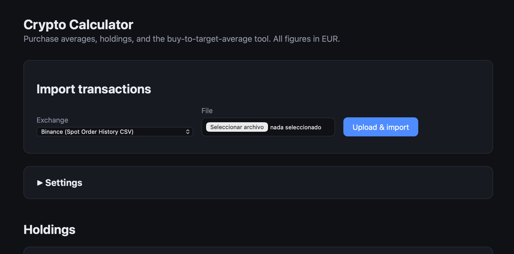
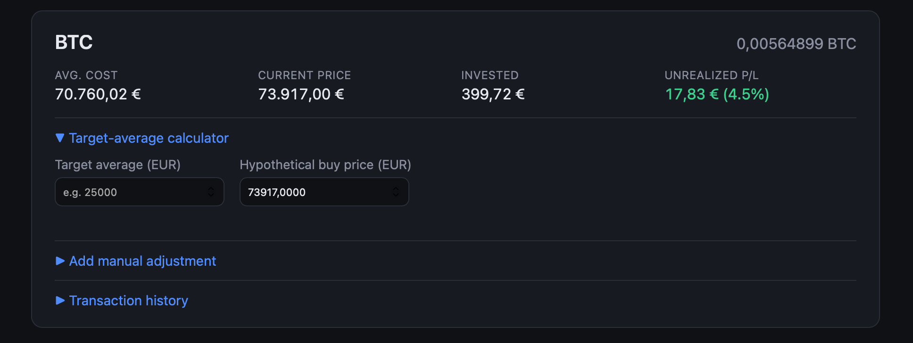

# Crypto Calculator

A personal web app that combines my Binance and Coinbase trade exports into one view of **average cost per asset in EUR**, and answers a question the exchanges don't: *"how much would I need to buy, at what price, to bring my average cost to X?"*

Built by me with Claude as my coding partner. I set the requirements, made the product decisions below, and tested the results against my own real exchange exports.





## The problem

Each exchange shows its own trades in its own format and currency. None of them gives a single, cross-exchange average cost in EUR, and none answers "what do I need to buy to reach a target average?".

## What it does

- **Imports exchange exports**: Binance (Order History and Trade History exports) and Coinbase (Transaction History). Re-uploading the same file is safe, because duplicate rows are detected and skipped.
- **Normalises everything to EUR**: trades quoted in USD or stablecoins are converted with historical European Central Bank rates, and crypto-to-crypto trades (e.g. AVAX/BTC) are converted using the quote asset's historical EUR price.
- **Shows holdings per asset**: quantity, average cost, total invested, current price and unrealised P/L.
- **Target-average calculator**: enter a target average and a hypothetical buy price, and it tells you the quantity and EUR amount needed, or explains why the target can't be reached.
- **Manual adjustments**: add or remove individual transactions when an export is incomplete.

## Product decisions

- **EUR as the single base currency**, because that's my reporting currency.
- **Average-cost method, not FIFO.** It matches the "average buy price" people expect to see. It is *not* what Spain's tax authority uses for capital gains (FIFO), and the app says so rather than pretending to be a tax tool.
- **Skip, don't guess.** The first version skipped non-EUR trades instead of converting them at an invented rate. Conversion was only added once there was a reliable source (ECB rates via the Frankfurter API).
- **Validated against real files.** The first parsers were written against the exchanges' documented formats. Testing them on my real exports showed the Binance format differed, so the column mapping was corrected to match the real files.
- **Local and private by design.** Data lives in a local SQLite file on my machine, and personal data (database, CSV exports, data-fix scripts) is excluded from this repository.

## Run it

**Easiest (macOS):** double-click `run.command`. The first run installs dependencies, then it opens the app in your browser.

**From the terminal:**

```bash
python3 -m venv venv
source venv/bin/activate
pip install -r requirements.txt
python -m backend.init_db
uvicorn backend.main:app --port 8000
```

Then open http://localhost:8000.

## Tech

Python · FastAPI · SQLAlchemy + SQLite · pandas · plain HTML/CSS/JavaScript · ECB exchange rates (Frankfurter API) · CoinGecko prices

```
backend/
  main.py           API routes
  calculations.py   average-cost and target-average maths
  fx.py             historical currency conversion to EUR
  crypto_prices.py  historical crypto prices in EUR
  prices.py         current prices for the dashboard
  parsers/          one module per exchange export format
frontend/           dashboard (HTML, CSS, JS)
```

To add another exchange, add a parser under `backend/parsers/` that returns rows in the shape defined in `backend/parsers/base.py`, then register it in `backend/main.py`.

## Limitations

- Average-cost method only, so it's not suitable for tax filings that require FIFO.
- Current prices come from CoinGecko's free API on a best-effort basis. If a price can't be fetched, it shows as unknown.
- Single-user and runs locally. There's no login and no hosting.
